###open a terminal
####run: cd spark-cluster
####run: docker-compose up --scale spark-worker=3
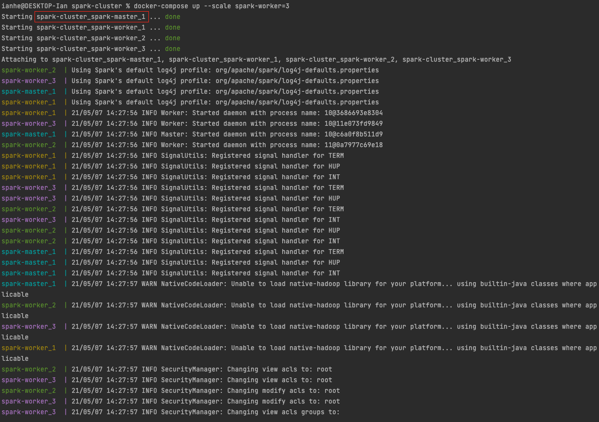
 
###copy the spark cluster's name, open another terminal
####run: docker exec -it spark-cluster_spark-master_1 bash
####run: cd spark
####run: ./bin/spark-shell
####see: Spark context available as 'sc', Spark session available as 'spark'
####Spark Console will be available at: http://localhost:4040/jobs/
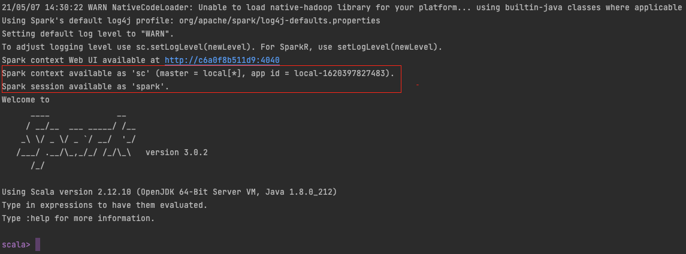
 
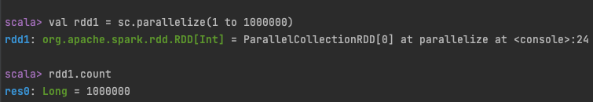
####the count job will be showing at the Spark Console
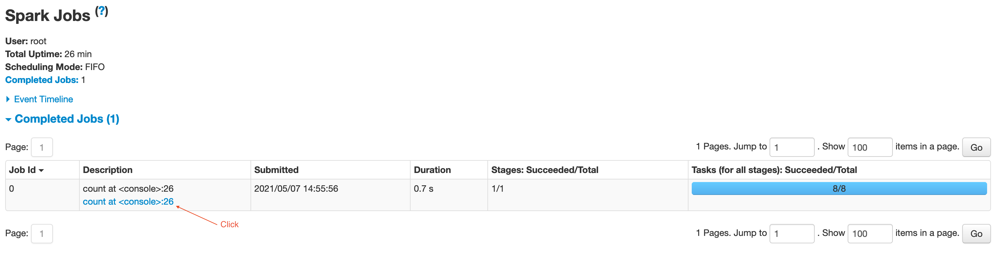
####Click the description, will show Details for Job with completed Stages
####There are 8 tasks which is 8 partitions
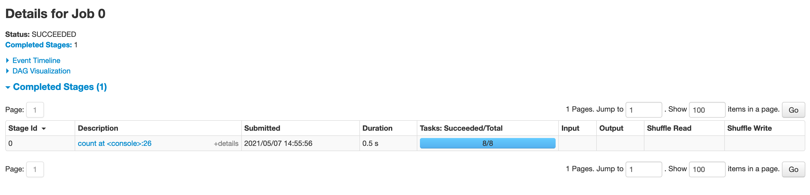
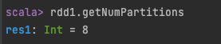
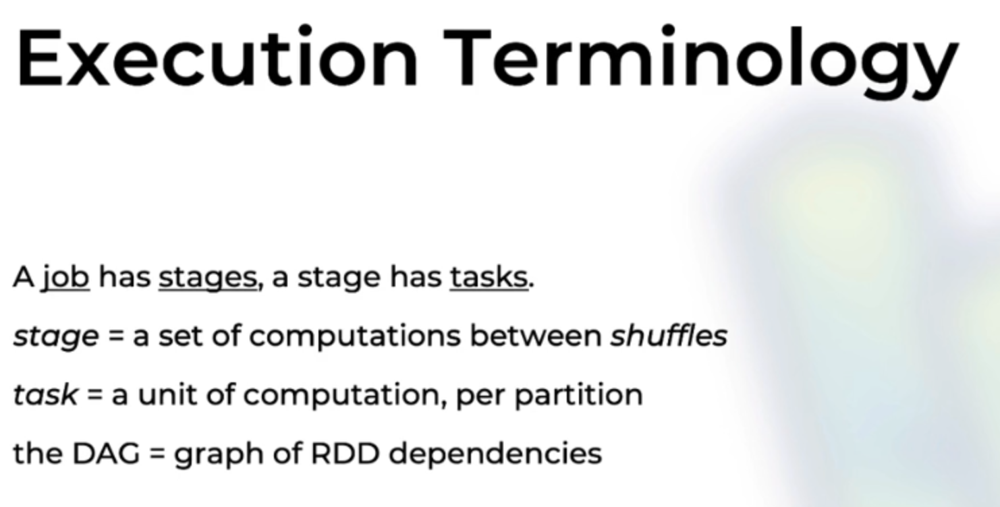
 
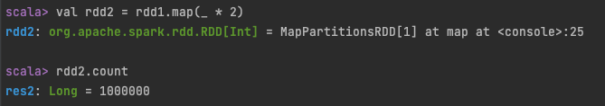
####The DAG shows 2 elements in the stage
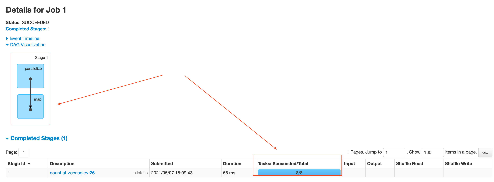
 
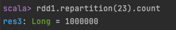
####The job has 2 stages, 31 tasks(partitions)
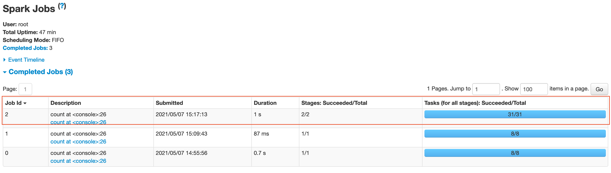
####Job Details show 2 stages - Stage 2 & Stage 3 (Spark count stages from 0 since the first job)
#### - Stage 3 takes 23 tasks with Shuffle Read, Stage 2 takes 8 tasks with Shuffle Write
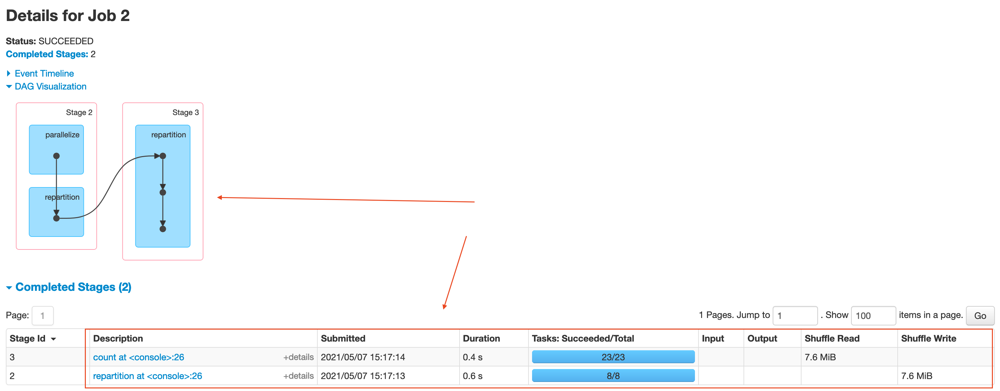
 
####convert RDD to DF
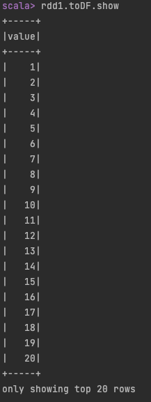
####The job is single task
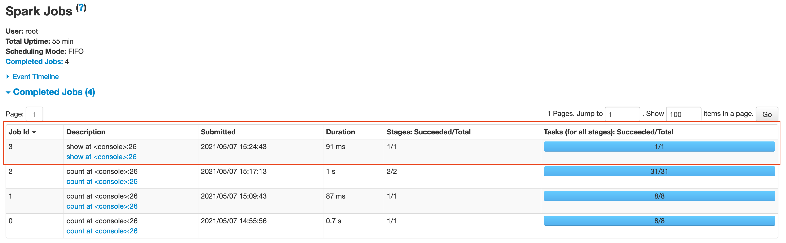
####The details show convert RDD to DF takes 4 Steps(parallelize -> scan -> wholeStageCodegen -> mapPartitionsInternal)
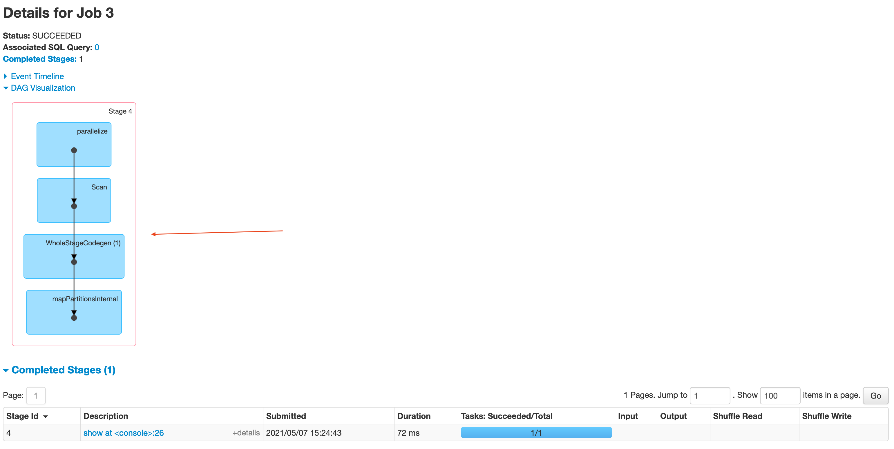
 
####Create Dataset
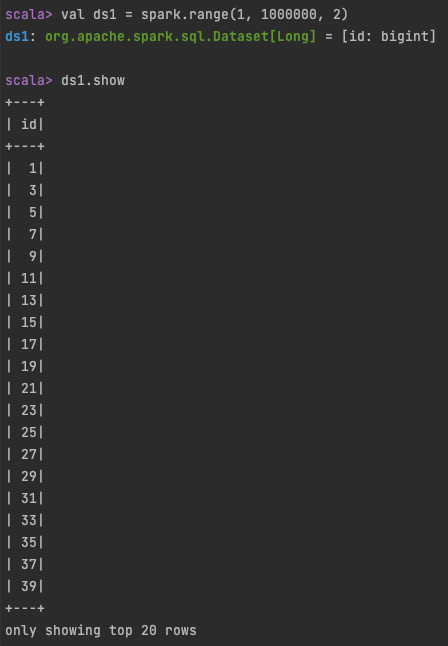
####Job Details show 2 steps in the stage(Spark organize steps behind the scene, user do not have control over this)
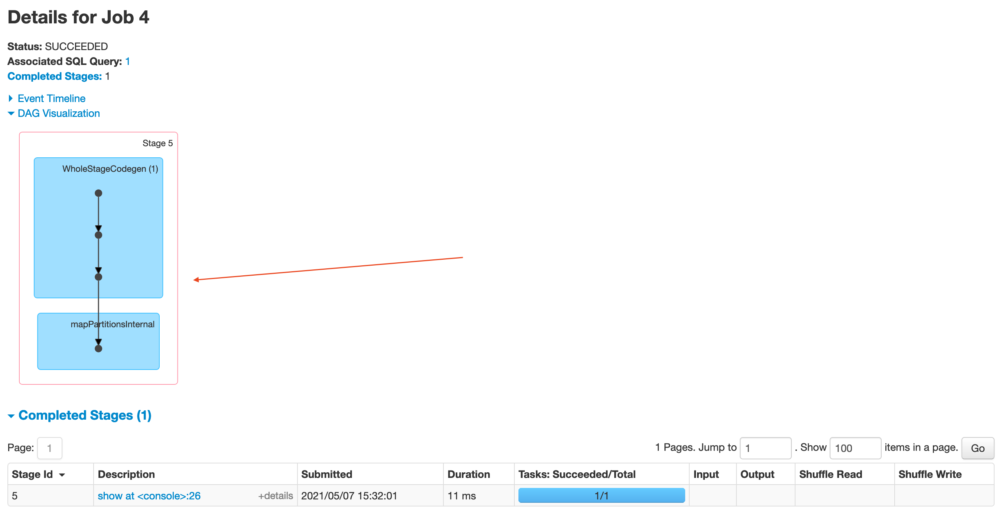
####run physical plan to explain the steps and splits(partitions)
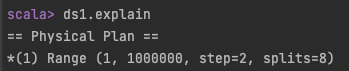