###open a terminal
####run: cd spark-cluster
####run: docker-compose up --scale spark-worker=3
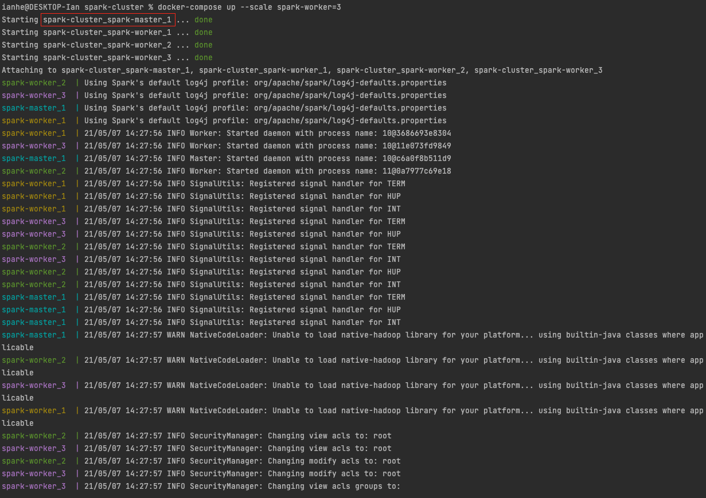
  
###copy the spark cluster's name, open another terminal
####run: docker exec -it spark-cluster_spark-master_1 bash
####run: cd spark
####run: ./bin/spark-shell
####see: Spark context available as 'sc', Spark session available as 'spark'
####Spark Console will be available at: http://localhost:4040/jobs/
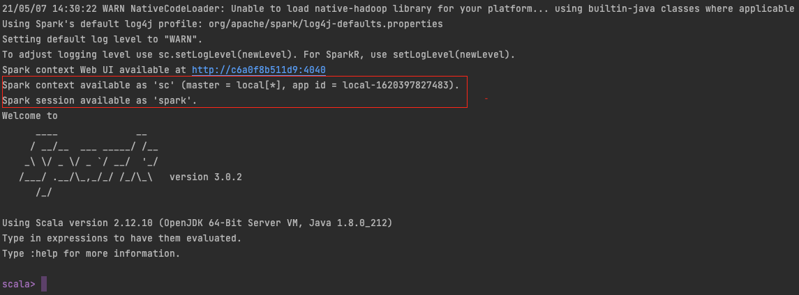
  
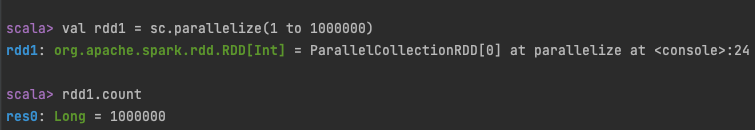
####the count job will be showing at the Spark Console
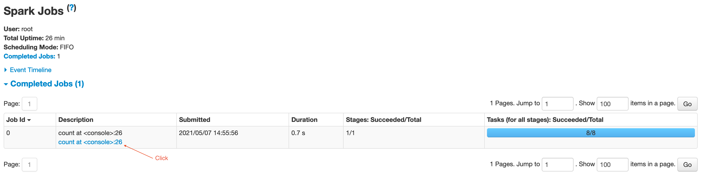
####Click the description, will show Details for Job with completed Stages
####There are 8 tasks which is 8 partitions
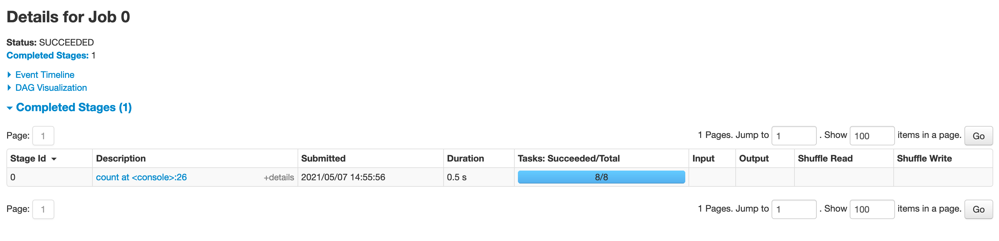
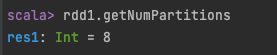
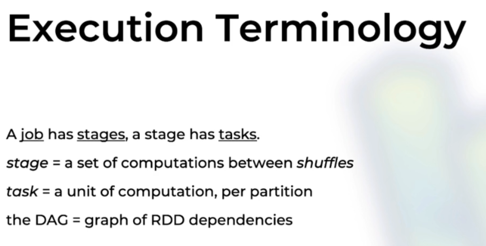
  
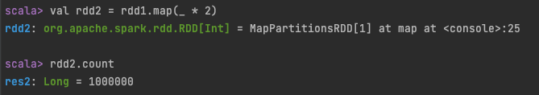
####The DAG shows 2 elements in the stage
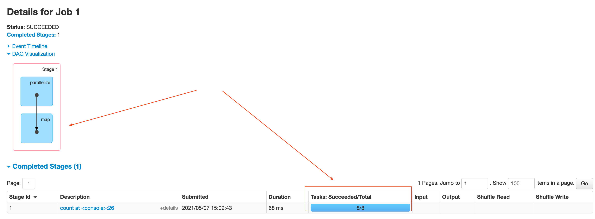
  
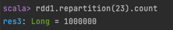
####The job has 2 stages, 31 tasks(partitions)
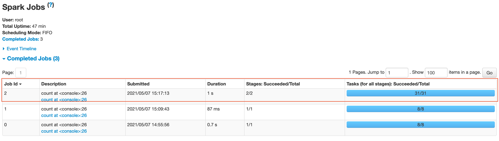
####Job Details show 2 stages - Stage 2 & Stage 3 (Spark count stages from 0 since the first job)
#### - Stage 3 takes 23 tasks with Shuffle Read, Stage 2 takes 8 tasks with Shuffle Write
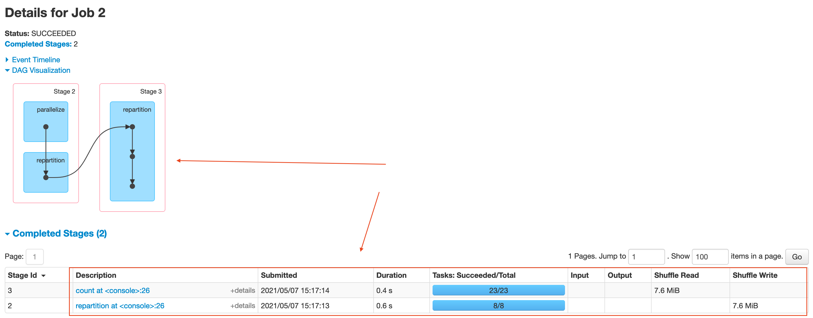
  
####convert RDD to DF
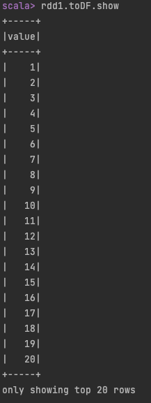
####The job is single task
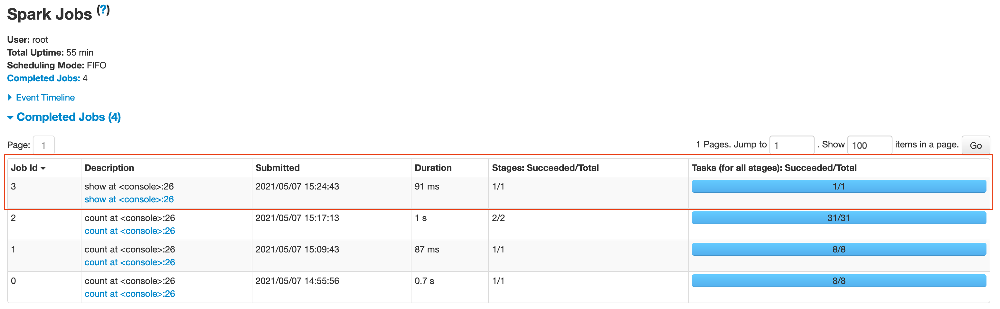
####The details show convert RDD to DF takes 4 Steps(parallelize -> scan -> wholeStageCodegen -> mapPartitionsInternal)
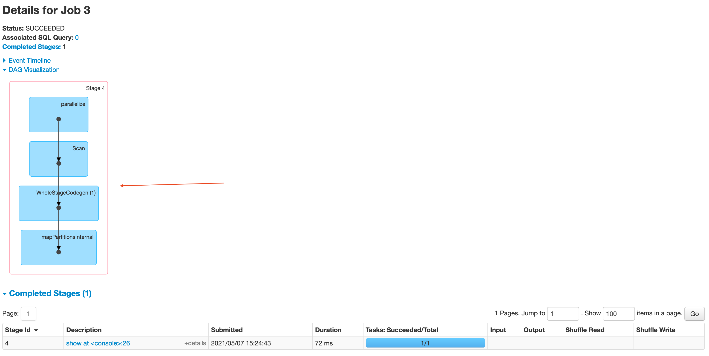
  
####Create Dataset(with 2 steps)
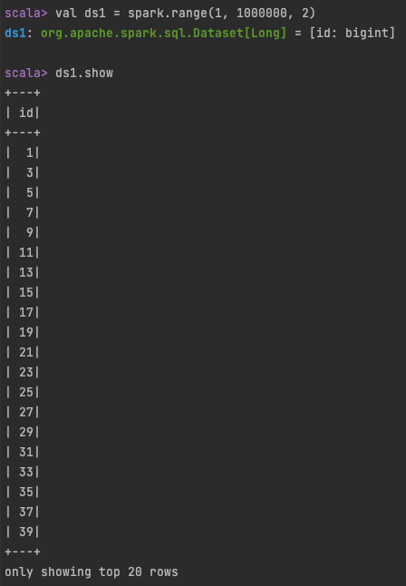
####Job Details show 2 steps in the stage(Spark organize steps behind the scene, user do not have control over this)
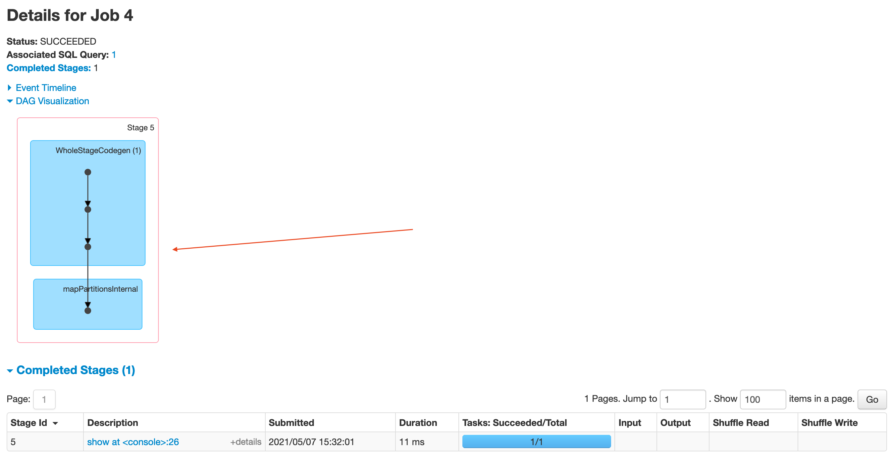
  
####run physical plan to explain the steps and splits(partitions)
####a physical plan describes all the operations that spark will do to compute the dataset
####splits =8 means spark will do 8 partitions for this dataset
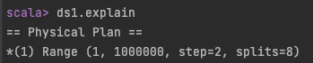
  
####Lets creat a new dataset ds2 by using 5 steps
####repartition ds1 with 9 partition
####the physical plan shows: spark will do splits with 8 first then do => Exchange RoundRobinPartitioning(9), 9 is the new number of partitions
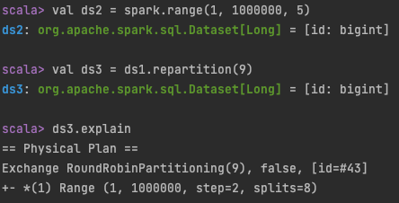
  
####Lets do the repartition on ds2
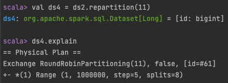
  
####define ds5 by using selectExpr on ds3
####(ds1)Range(...) => (ds2)repartition => (ds5)selectExpr
####'#11L' is the identifier of the column, '#28L' is the identifier of the new resulting column
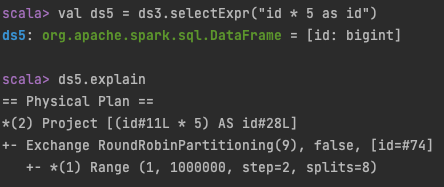
  
####lets do a join on ds5 with ds4
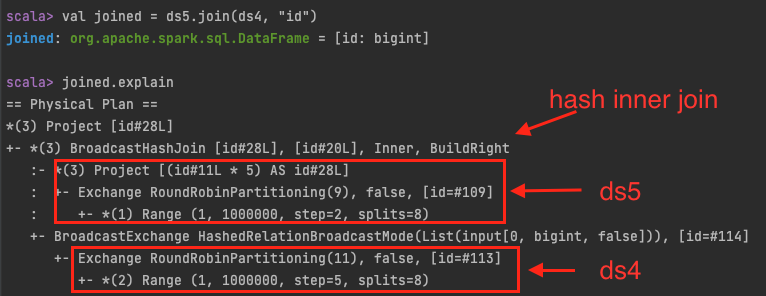
  
####lets do an aggregate function on the joined 
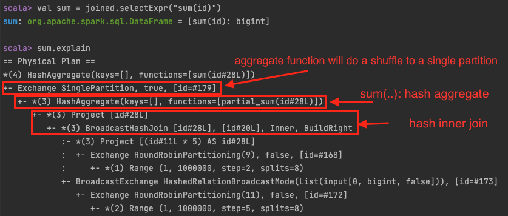
  
####If you want to see everything spark has planed before run the job, you can run sum.explain(true)
####Parsed Logical Plan =>  Analyzed Logical Plan => Optimized Logical Plan => Physical Plan
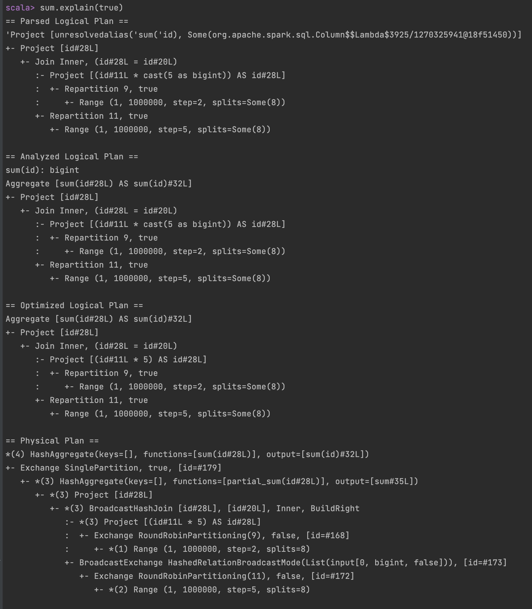
  
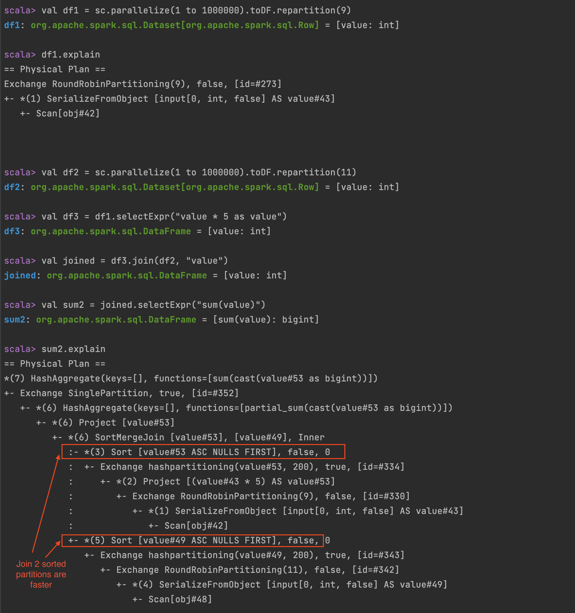
