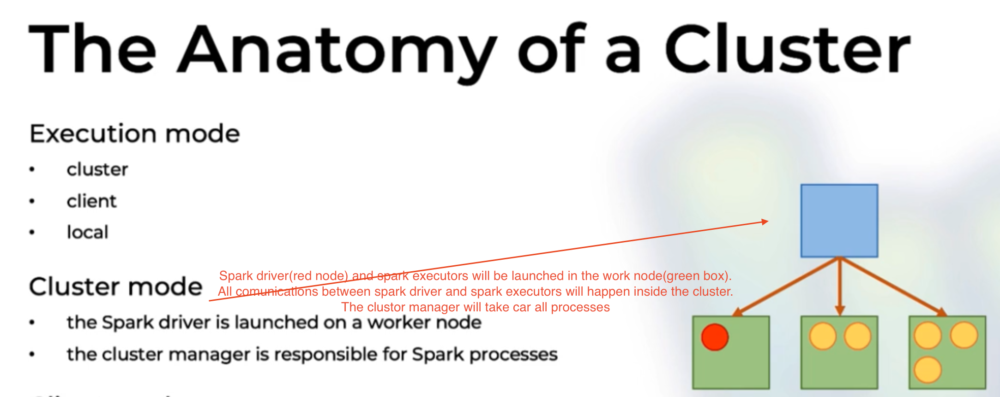
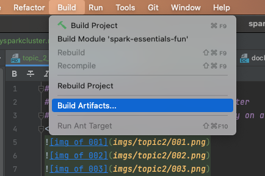

###Objective
####- Learn the anatomy of a Spark cluster
####- Start a Spark application directly on a cluster
  

  
####Add TestDeployApp.scala
####Add Jar in Artifact and build artifact jar file

####In spark-cluster/docker-compose.yml, the ./app & ./data will be mounted to /opt/spark-app & /opt/spark-data

####Copy out/artifacts/spark_essentials_fun_jar/spark-essentials-fun.jar to spark-cluster/apps
####Copy src/main/resources/data/movies.json to spark-cluster/data
####In the terminal, run: cd spark-cluster -> docker-compose up --scale spark-worker=3

####In another terminal, run: docker exec -it spark-cluster_spark-master_1 bash
####the spark-apps contains spark-essentials-fun.jar and spark-data contains movies.json

####cd /spark/bin and run: with --verbose to view all the running steps and information

####After a while, goodComedies are generated
