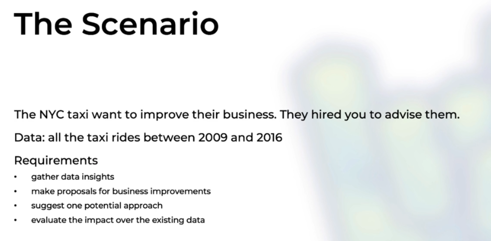
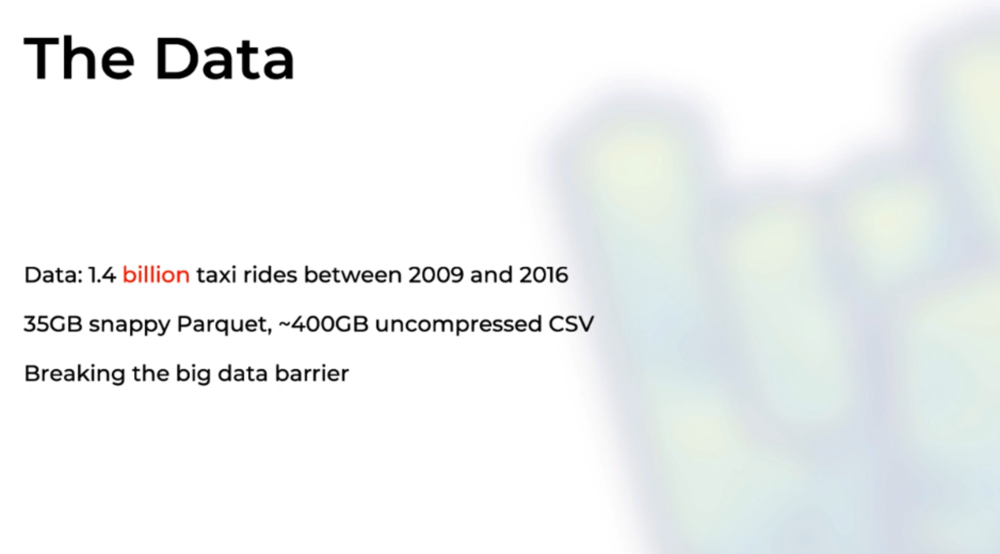
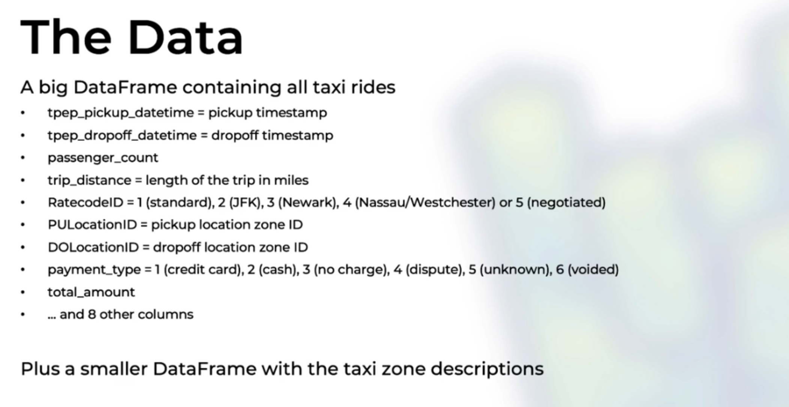
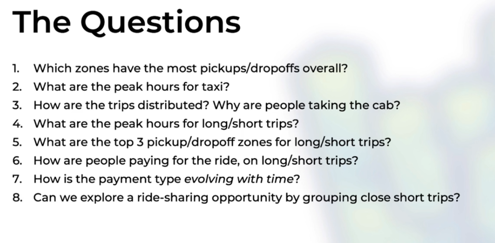

###Project Requirements

###About the data

###Analyzing questions from the data

###Data visualized(Plotting data to a map) by Ravi Shekhar

####Retrieve data:
#####- (only have a look) search "nyc taxi data" and view https://www1.nyc.gov/site/tlc/about/tlc-trip-record-data.page
#####- go to https://academictorrents.com/ -> search "taxi" -> (to analyze the whole data) download "New York Taxi Data 2009-2016 in Parquet Fomat"
#####- download "Taxi Zone Lookup Table (CSV)" from https://www1.nyc.gov/site/tlc/about/tlc-trip-record-data.page